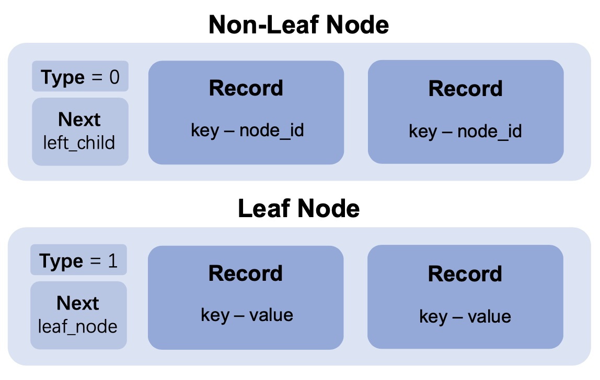
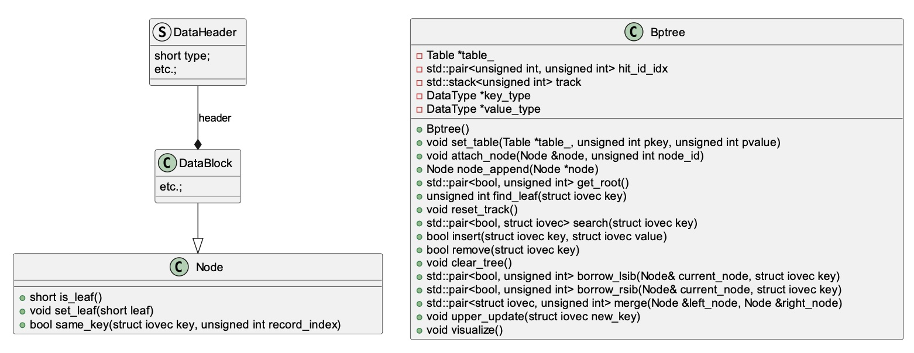
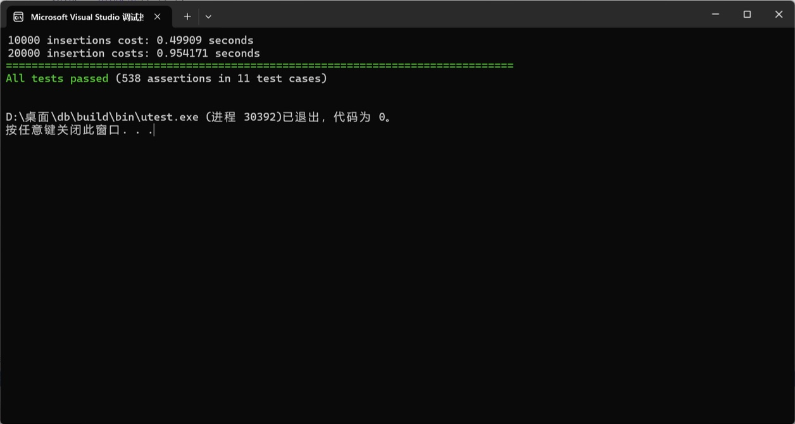
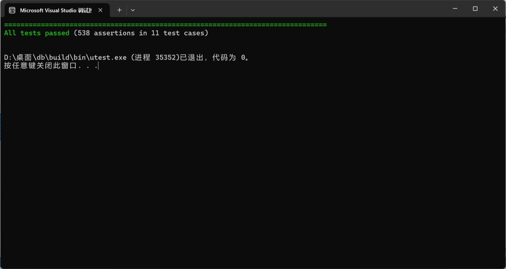

# B\+ Tree Based Clustered Index Project

## Project Introduction

This project is a course experiment for the Database System Principles and Implementation, with the aim to gain an in-depth understanding of B\+ tree based clustered index implemented in database systems. The project focuses on designing and implementing the B\+ tree data structure and its basic operations (insertion, deletion, and search), as well as realizing a clustered index to store data records in primary key order.

## Core Features

  * **B\+ Tree Data Structure Design** : The project designs the B\+ tree nodes (both leaf and non‑leaf nodes) based on the existing project components. The node structure is designed as follows.  
    

  * **Search** : Implements the `search()` function and the auxiliary `find_leaf()` function to accurately locate the leaf node corresponding to a specified key and return the key‑value pair.  
  * **Insert** : Implements the `insert()` function to insert key‑value pairs into the correct leaf nodes and handle node splitting to maintain tree balance.  
  * **Delete** : Implements the `remove()` function and related auxiliary functions to delete specified key‑value pairs from the B\+ tree and maintain tree balance through key borrowing or node merging operations.  

## Project Structure

  * **Node Class** : Represents a node in the B\+ tree, derived from the `DataBlock` class. It introduces new methods like checking if it's a leaf node, setting a leaf node, and comparing keys.  
  * **Bptree Class** : Corresponds to the B\+ tree used for the clustered index. It contains core methods such as insertion, deletion, and search, as well as auxiliary methods like visualization and tree clearing.  
  > Class Diagram is as follows  
    

## Testing

We built a CATCH2 unit‑test suite to verify the correctness and efficiency of the project:

* **Validation of Core Operations** : search (incl. empty tree, single‑leaf, multi‑level and boundary‑key paths), insert (root/leaf/internal splits, duplicate‑key rejection, and continuous splits with tree order 4), delete (seven scenarios from “key‑not‑found” to multi‑level merges that reshape the root), and clear‑tree resource recycling.  
* **Scalability Checks** : Re‑ran inserts with tree order 100 and bulk‑loaded 10 k / 20 k records; timings tracked with an internal timer confirmed the expected *O(log n)* growth.  
  

* **Overall Results** : Passes all 538 assertions in 11 test cases, demonstrating functional correctness and performance soundness across all edge conditions.  
  
